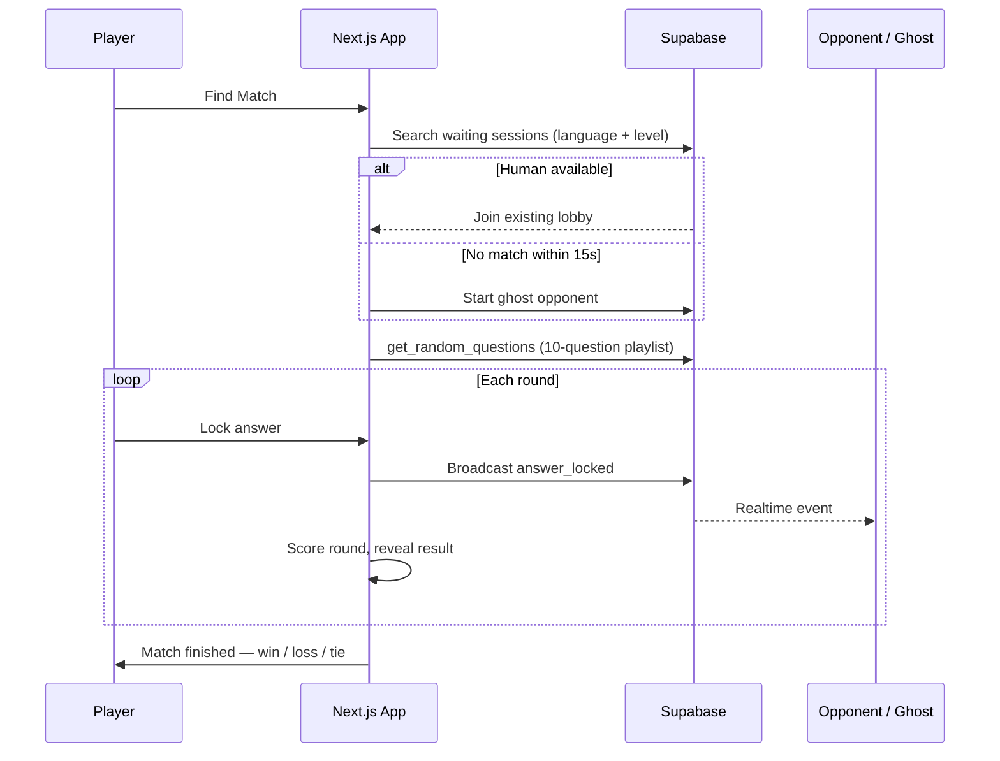

# Language Quiz

Real-time, 1v1 language trivia for learners. Players sign in, pick a target language and CEFR level, then compete in live head-to-head matches against real opponents—or a ghost fallback when the queue is empty.

Built with **Next.js**, **Supabase**, and **Vercel**.

---

## What it does

Language Quiz is a multiplayer learning game, not a static flashcard app. Every match is a timed duel: ten questions across grammar, vocabulary, fill-in-the-blank, and idioms, with points awarded for both accuracy and speed.

| Feature | Description |
| --- | --- |
| **Bracket matchmaking** | Pairs players by target language and proficiency level (A1–C1) |
| **Live sync** | Supabase Realtime broadcasts keep both clients in lockstep during a match |
| **Ghost opponents** | If no human joins within 15 seconds, a simulated opponent fills the slot |
| **Speed scoring** | Faster correct answers earn more points; ties break on average response time |
| **Question quality** | Players can flag bad questions; three reports auto-quarantine a item for admin review |
| **Resilient UX** | Global error boundary clears stale match state and retries on connection drops |

Supported languages: **English**, **Italian**, **Spanish**.

---

## How a match works



Each playlist is built server-side and avoids recently seen questions so repeat matches stay fresh.

---

## Tech stack

- **[Next.js 14](https://nextjs.org/)** — App Router, Server Components, Server Actions
- **[Supabase](https://supabase.com/)** — Auth, Postgres, Row Level Security, Realtime
- **[Zustand](https://zustand.docs.pmnd.rs/)** — Persisted in-match game state
- **[Tailwind CSS](https://tailwindcss.com/)** + **[shadcn/ui](https://ui.shadcn.com/)** — UI components
- **[Vercel](https://vercel.com/)** — Deployment with edge-cached static assets

---

## Project structure

```
app/                  # Routes, layouts, server actions
components/           # UI, match loop, matchmaking lobby, admin tools
hooks/                # Game loop, audio
store/                # Zustand match state (persisted)
lib/                  # Auth, scoring, bots, constants
utils/supabase/       # Browser, server, and middleware clients
supabase/             # SQL migrations (schema, matchmaking, reports, indexes)
database.sql          # Core game tables, RPCs, and RLS policies
public/sounds/        # Match SFX (reveal, click, correct, incorrect)
```

---

## Getting started

### Prerequisites

- Node.js 20+
- A [Supabase](https://supabase.com/) project
- npm

### 1. Clone and install

```bash
git clone <your-repo-url>
cd language-quiz
npm install
```

### 2. Environment variables

Create `.env.local` in the project root:

```env
NEXT_PUBLIC_SUPABASE_URL=https://your-project.supabase.co
NEXT_PUBLIC_SUPABASE_ANON_KEY=your-anon-key
```

Find both values in Supabase → **Project Settings → API**.

### 3. Database setup

Run these SQL files **in order** in the Supabase SQL Editor:

1. `supabase/schema.sql` — user profiles and auth triggers
2. `database.sql` — questions, sessions, stats, match RPCs
3. `supabase/matchmaking-migration.sql` — language/level on sessions, join policies
4. `supabase/reports-migration.sql` — question flagging and admin role
5. `supabase/performance-indexes.sql` — production query indexes

Then enable Realtime for matchmaking:

- Supabase → **Database → Replication**
- Turn on replication for the `game_sessions` table

### 4. Seed questions

Add rows to `questions_active` for each `(language, level, category)` combination you want to support. Categories must be one of:

- `grammar`
- `vocabulary`
- `fill-in-the-blank`
- `idioms`

The `get_random_questions` RPC builds a 10-question playlist (3 + 3 + 3 + 1 per category).

### 5. Run locally

```bash
npm run dev
```

Open [http://localhost:3000](http://localhost:3000).

---

## Deployment

Deploy to Vercel and add the same environment variables in the project settings. The included `vercel.json` configures long-lived edge caching for game audio and other static assets.

```bash
npm run build   # verify production build locally
npm run lint    # ESLint
```

---

## Admin access

After running `supabase/reports-migration.sql`, promote a user in the SQL Editor:

```sql
update public.users set role = 'admin' where email = 'you@example.com';
```

Admins can review quarantined questions at `/admin`.

---

## Scoring reference

| Response time | Points (if correct) |
| --- | --- |
| Under 5s | 140 |
| 5–10s | 130 |
| 10–15s | 120 |
| 15–25s | 100 |
| Over 25s or wrong | 0 |

Round timer: **25 seconds**. Match length: **10 questions**.

---

## License

Private project — all rights reserved unless otherwise specified.
